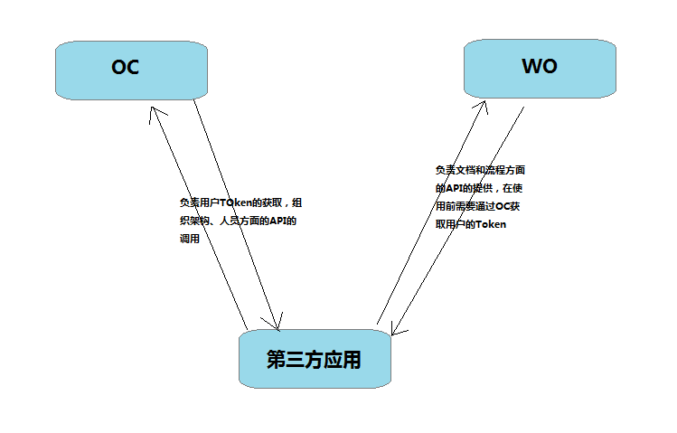

==================================
OAuth2接口：应用授权访问
==================================

接口简介
=============
易度开放平台（Everydo Open Platform）是基于易度办公平台，为第三方应用提供授权访问控制，
使第三方应用可以访问易度办公平台提供的各种服务。

易度开放平台使用 `OAuth2.0协议  <http://oauth.net/2/>`_  来管理第三方应用的授权和访问。

申请应用
===============
首先向易度（developer@everydo.com）申请一个应用的ID和密钥，根据易度提供的API文档，开发您的应用。

OAuth2.0的登录流程
===========================

易度办公平台区分了用户认证和管理中心（OC）和文档与流程的存储管理中心（WO），应用请求用户授权和不同的API的使用需要向不同的服务发起请求，具体参见下图：

使用OAuth2.0的流程可以简单概括为：

1. 应用向文档系统请求授权
2. 文档系统为用户显示一个授权页面，用户在此页面确认是否同意应用的请求
3. 如果用户同意授权，应用会获取到一个临时口令(code)
4. 应用再次先系统发起请求，验证应用自身的安全性，文档系统返回一个授权令牌(access_token), 通过此令牌，应用可以访问授权用户的数据。
5. 如果访问需要授权的Api，在每一个请求中加上access_token的Header

接口文档
===================

===================          ===============================
接口                         说明
===================          ===============================
authorize_ （OC)             请求用户授权Token
access_token_  (OC)          获取授权过的Access Token
===================          ===============================

authorize 
------------------
基于OAuth2的authorize接口，用了得到用户的临时授权

1. URL示例

    https://example.oc.everydo.com/authorize

2. HTTP请求方式

    GET/POST

3. 请求参数

    =============  ======== ===============   =========================================================
    参数名            必填   类型及范围            说明
    =============  ======== ===============   =========================================================
    client_id       true     string	            申请应用时分配的AppKey。
    redirect_uri    true     string	            授权回调地址
    =============  ======== ===============   =========================================================

4. 返回数据

    =========== =========== ========================================================
    返回值字段  字段类型    字段说明
    =========== =========== ========================================================
    code        string      用于调用access_token，接口获取授权后的access token。
    =========== =========== ========================================================

5. 示例

:: 

  //请求
  https://example.oc.everydo.com/authorize?client_id=123050457758183&redirect_uri=http://www.example.com/response&response_type=code

  //同意授权后会重定向
  http://www.example.com/response&code=CODE

access_token
------------------
基于OAuth2的access_token接口， 

1. URL示例

    https://example.oc.everydo.com/access_token

2. HTTP请求方式

    GET/POST

3. 请求参数

    =============  ===== ===============   =====================================================================
    参数名          必填      类型及范围            说明
    =============  ===== ===============   =====================================================================
    client_id      true   string           申请应用时分配的ID
    client_secret  true   string	       申请应用时分配的AppKey
    grant_type     true   string           请求的类型，可选（authorization_code、password、refrash_token)
    code           false  string           调用authorize获得的code值（grant_type为authorization_code时需要填写）
    refrash_token  false  string           获取新的access_token需要（grant_type为refrash_token是需要填写）
    username       false  string           用户名（grant_type为password是需要填写）
    password       false  string           密码（grant_type为password是需要填写）
    =============  ===== ===============   =====================================================================

4. 返回数据

    =============== =========== ========================================================
    返回值字段      字段类型    字段说明
    =============== =========== ========================================================
    access_token    string      用于调用access_token，接口获取授权后的access toke
    refrash_token   string      用于更新用户的access_token， 只能使用一次
    =============== =========== ========================================================

5. 返回数据

:: 

  {
       "access_token": "ACCESS_TOKEN",
       "refrash_token": "REFRASH_TOKEN",
       "expires_in": 1234,
       "remind_in":"798114",
       "uid":"user.admin"
  }

