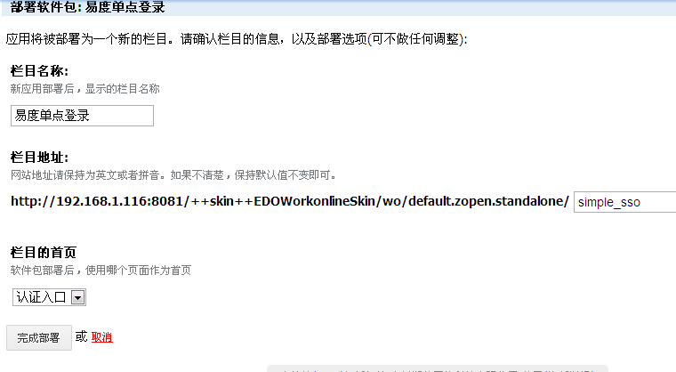
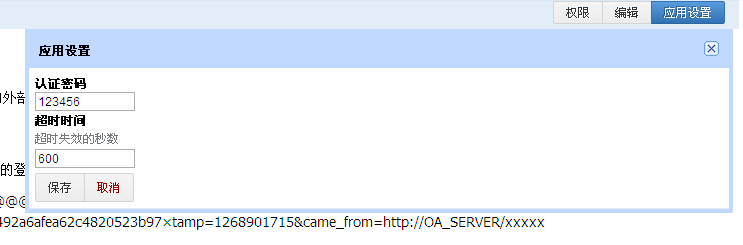

================
简单单点登录接口
================
.. contents:: 内容
.. sectnum::

以系统管理登录系统，进入应用市场，点击安装这个应用
--------------------------------------------------

.. image:: img/simple-sso1.png

- 然后部署这个软件包

- 部署完成，进入单点登录界面，会出现“密匙错误”，可在应用设置中设置下应用授权密码和超时失效时间。

URL接口
-------
- 通过一个带签名信息的URL链接来实现的登录，URL地址为::

      http://hoeron.easydo.cn/simple_sso/@@@zopen.simple_sso.sso?username=tt1024&sign=8509c9fb03492a6afea62c4820523b97×tamp=1268901715&came_from=http://OA_SERVER/xxxxx

url参数含义
------------
a) @@@zopen.simple_sso.sso是单点登录入口
b) username是登录的用户名
c) sign是签名信息: md5签名信息，如果签名验证通过，就认证成功
d) timestamp是时间戳:签名的时间，签名仅仅在生成之后一段时间范围内有效
e) came_from是登录后跳转的URL: 认证成功后调整的目标URL，对于API访问，这个字段可忽略
  
- 登录签名生成的算法是： MD5(填写的用户名+应用授权密码+时间戳)
- 如果应用授权密码为123456，sign=MD5('tt10241234561268901715')
==========
 验证原理
==========
a) 应用授权密码，用于双方系统之间的验证，由系统两方协定，并不是用户的登录密码。点击右上 “应用设置”，可以设置 授权密码和超时失效时间；
b) 双放系统的用户名相同 ，可将用户导入即可
c) 如果是C/S,返回sessonid.
d) 关于安全性方面，由于验证签名是经过md5摘要的，比较难逆向出原文，并且添加了时间戳作为生成sign验证码条件，使得每次生成的验证码均不同，无法伪造登录信息。
