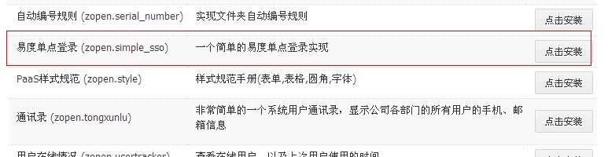

================
简单单点登录接口
================
.. contents:: 内容
.. sectnum::

易度提供简单单点登录功能，可实现和外部系统之间的双向单点登录，支持直接的web单点登录。

开启易度的单点登录

以系统管理登录系统，进入应用市场，点击安装这个应用
--------------------------------------------------

- 然后部署这个软件包

.. image:: img/simple-sso2.png

- 部署完成，进入单点登录界面，会出现“密匙错误”，可在应用设置中设置下应用授权密码和超时失效时间。

.. image:: img/simple-sso3.png

URL接口
-------
