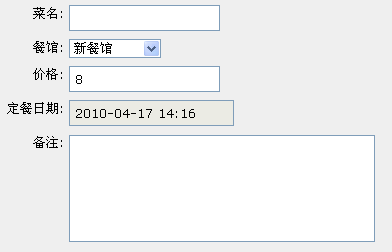

======================================
表单和流程进阶
======================================

经过第一课的表单，和第二课的流程，我们来总结一下一些概念：

1. 流程定义之前，需要先在数据表单中定义流程单包含的输入项
2. 流程的执行分为多个步骤, 每个步骤有负责人，可设置能够填写哪些表单输入项
3. 流程的每个步骤，可设置多个操作，比如 同意 或者 打回。不同的操作允许设置不同的流程走向。
4. 流程设置，是整个流程的一些可变的参数设置。

   每个流程部署后，可由管理员设置特定的流程设置参数

在这一课中，我们将继续深化，掌握一些高级的流程表单定制技术。

.. sectnum::
.. contents::

让非开发人员可以资源设置可选餐馆
======================================
问题
--------------
在易度系统中，表单的定义、流程的定义都属于软件开发的范围。

所以，一般是不允许普通用户使用的。普通用户是使用经过数据管理器部署的表单。

现在餐馆是在 表单定义中通过表达式来定义的::

  ['百玉蓝', '鱼米之湘', '洞庭土菜馆','兰州面馆']

这虽然不麻烦，但是表单定义是开发人员才能干的活啊。对于普通用户，这个显然是不合理的。

解决方法
------------------------
普通用户在部署好的数据管理器中，流程设置里面，简单设置下就好了。

定义新的流程设置
------------------
1. 进入订餐单的 流程设置里面，添加一个多行文本的变量

   .. image:: img/flow2-newfield1.jpg

2. 这个变量就是让用户输入的 可选餐馆 设置了，如下图

   .. image:: img/flow2-addfield.png

3. 我们检查一下，看看部署的订餐单数据管理器中的设置是否已经有了这个输入项了

   .. image:: img/flow2-newfield2.jpeg

果然有了，订餐妹妹根据需要可以自行调整了！

让流程单使用流程设置中的可选项
---------------------------------------
在 软件包 -> 订餐系统 -> 数据表单 -> dingcan 中，找到 canguan 餐馆 输入项，调整下最后的那个可选项为 ISettings(container)['canguan'] ：

.. image:: img/flow2-usesettings.jpeg

好，看看最终的效果吧：

上一章已经说过咯，不知道各位还记不记得。ISettings(container)['canguan'] 是取得流程设置里字段为canguan 的值

订餐成功/失败发送通知
========================
现在订了没订，都没个动静的，和我们认真负责的行政妹妹风格不一啊。

让我们的系统更人性化一点，订餐后，自动通知吧！

在导航菜单中，定位到 订餐 通过 操作：

.. image:: img/flow2-action-pass.png

在左侧表单下方的触发脚本中填写如下文字::

 msg_notifier.send('成功订餐', 
                   '您的订餐： %s 已经订餐成功，届时请正确认领' % context['title'],
                   context['creators'], bound_obj=sheet
                  )

我们用另外一个人登陆订餐，然后审核，最后会收到如下的通知：

.. image:: img/flow2-notify.png

**说明:** 关于 msg_notifier.send() 的解释，请看我们的api 通知引擎_

其中 context 和 ISettings(container) 类似，context 在这里代表流程关联的表单。

同样 title、creators 是目标咯！

'您的订餐： %s 已经订餐成功，届时请正确认领' % context['title'],

这段代码的意思，我想学过编程语言的同学都应该知道，但是我还是有必要说说。

意思是，把表单字段 title 的值取出，嵌入 %s 的位置。具体效果看上图：

.. _通知引擎: ../api/notification.rst

使用前的设置
======================
现在表单的定义，流程单的定义都已经弄好了。在创建数据管理器之后，创建表单记录之前需要在数据管理器设置里面设置下，我们在流程单里面定义的两个字段

.. image:: img/sheet-settings.jpeg

后续的学习
======================
到这里，这个小小的教程也告一段落了。但是这个教程所呈现的只是易度系统这个庞大的家伙的一个小小的角落。

而且易度系统也一直在不停的在前进，我们愿和广大的读者与系统一起前进。一起去探索我们所未知的领域。

如果您已经对易度产生了兴趣，如果您有对知识的渴望，可以去我们更高级的教程学习 易度应用开发指南_

不过要想轻松学习高级教程，是需要学习强大而简洁 python 语言。她是谁？ 来这里看看_

我们也会一直完善我们的教程,但请相信易度是不会让各位失望的。

.. _易度应用开发指南: ../api

.. _来这里看看: http://zh.wikipedia.org/zh-cn/Python

后续作业
=====================
1. 学习下api，看看如何让提交人的部门经理成为审核人？
2. 多人审核，投票决定后续步骤，学习下后续步骤表达式，以及task.vote方法
