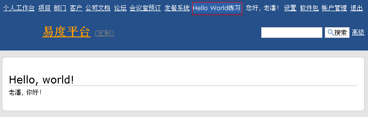

===============================================
易度Hello, world
===============================================
所有程序员在开始第一个新的程序技术的时候，
都会首先通过Hello, World来对世界表达博爱和精神，以及自己轻松愉悦的情愫。

那么，我们来一次易度版本的Hello, World.

.. sectnum::

认识易度开发平台
======================
易度和其他的云端开发平台，有如下相似性：

- 和Google app engine一样，采用python为开发语言
- 和salesforce一样，定位为企业级应用开发
- 和zoho creator一样，强调开发的简洁性

但易度是纯正国货，开发方式和一个有些古老的开源应用框架 `zope <http://zope.org>`__ 有些相似。

废话少说，演出开始了。。。

注册一个平台开发账号
==========================
和传统软件不同，易度平台提供的是一个云端的开发环境。 
在易度中，传统开发过程中的数据库建模、编码调试和部署等环节，都是在浏览器中完成的.

从易度平台，从版本V3.0开始，正式支持PaaS开发。因此，您需要注册一个新平台的账号。

`点击这里注册开发平台帐号 <../signup.rst>`__

注册完成，根据提示登录系统后，会进入账户管理模块. 

.. image:: img/account.png
   :width: 600

点击左上角的“回到工作台”，进入易度工作平台。

创建软件包
=======================
点击右上的“软件包”栏目，进入软件包开发管理模块。点击右侧的新建软件包按钮，为我们要开发的"hello world"制作一个软件包：

.. image:: img/newpkg.png
   :width: 600

这里，helloworld是这个软件包的代号，唯一标识这个软件，注意不能和其他的软件包重名。

创建完成后，进入软件包开发界面，如下:

.. image:: img/pkghome.png
   :width: 600

这个新建的软件包，还没有任何数据库对象或者流程，但是有包括了一个应用。这个应用有自己的首页(index)，并在应用设置中可为应用设置一些配置。

编写应用代码
=====================================
点击右侧导航树的index节点，进入index脚本，我们看到如下界面:

.. image:: img/index.png
   :width: 600

index页面是整个应用的首页(首页命名必须为index)，代码是在正文区书写。

python脚本采用python语言开发，python是一个和java/javascript都比较类似的脚本语言，也是谷歌云计算平台选择的语言之一。python很简单，您可以看看 `python教程 <http://czug.org/python/tutorial/>`__ ，有开发经验的人很快便可入门掌握。

默认代码输出一个字符串，这台没有创意了。
让我们想应用的使用者问候一下。

我们将正文区代码修改为::

     print '你好, ', request.principal.id
     return printed

相信您可以读懂代码。注意:

1. **print 在这里不会直接生效** 。但如果使用print，必须最后一句为 return printed
2. python脚本的最后一定是一条return，把需要显示给用户的结果返回回去。

好，保存代码，我们的开发工作就完成了！

(不能保存？那一定是代码语法存在问题，请根据提示，进行调整。)

部署Hello, World应用
======================
这里我们将应用部署到网站根栏目上，点击右侧导航的快速部署链接:

.. image:: img/quickdeploy-nav.png

这时候进入快速部署页面:

.. image:: img/quickdeploy.png

点击快速部署按钮，完成部署!

Hello, World!时刻
===========================
我们可看到，左上栏目上多了一个hello world的标签，而且能够正确得到当前登录用户的姓名了！

好，大工告成了，您有什么建议吗？欢迎告诉我们哦... (dev@zopen.cn)

一点点尾声
=======================
故事已经讲完，故事的主角，您，可能还不满足。

1. “慢着，慢着，python什么的是啥？你在说开发吗？我不懂哦”

   :-) 看看这个 `python非程序员教程 <python.rst>`__

2. “我是一个老鸟了。这个方式太离谱了，我还是习惯于从前的文件系统开发方式，怀念强大的版本管理工具”

   您或许喜欢各种开发框架的简洁，憎恨一切gui的开发环境。
   那易度还是能够满足您，请参看 `致轻量级web框架爱好者 <lightweight.rst>`__

