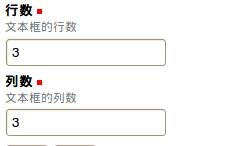
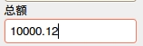
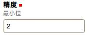
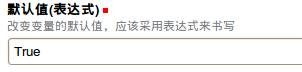
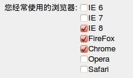
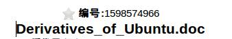
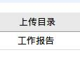
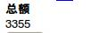
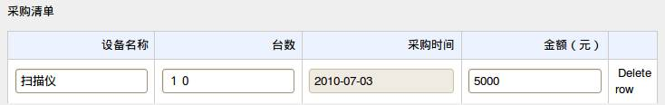
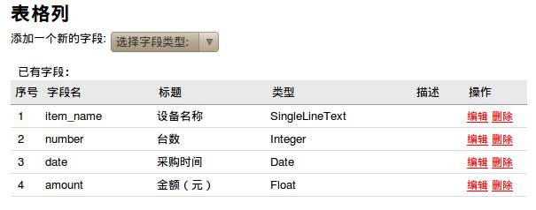

========================
表单定制详解
========================

.. Contents:: 索引:

.. sectnum::

字段的常用属性
=========================
变量名：
  字段在系统内部的标识符，运行表达式时作为字段的标识符。

标题：
  在表单中显示的名字

说明：
  对字段的描述、说明性的文字，多用于提示填写表单的用户

默认值：
  在创建表单时字段默认的值，可以使用表达式来计算，表达式计算的值根据不同的字段需求不同。

修改条件：
  在什么条件下允许修改该字段，可以用表达式，表达式的值必须是布尔类型

输入检查：
  当用户提交表单后，这个输入检查负责检查值是否合理，例如采购费用不能大于100时，需要用这个检查提交的值::

     value < 100 
        说明：用户输入的值必须是数字并且0小于100

     not value and '必须输入' 
        说明：必须填写该字段

如何写表达式
=======================
在制作复杂的表单中，表达式会被经常用到，表达式是什么呢？我们的表达式是Python语言的一个子集。Python语言以易学易用而闻名。对于复杂的表达式你可能需要对Python语言作进一步学习。对于如何调用和集成系统的API，请查看另外的API说明文档。

理解各种字段
======================
单行文本
----------------
用于输入只有一行的文本，例如项目名等

.. image:: img/fields-dan-wenben.jpeg

她除了拥有基本属性外，还拥有特殊的字段属性，宽度

.. image:: img/fields-width.jpeg

可以根据数值调整输入框的宽度。

文本框
------------
用于输入多行文本，例如详细信息，详细描述,备注等，可以设置输入的行数

.. image:: img/fields-duo-wenben.jpeg

她和单行文本不太一样。拥有行数，列数属性

可以设置文本框的大小。

密码
--------------
用于输入一些机要性的信息，例如用户口令等，跟单行文本基本相同，只是输入的回显会被星号代替

她有一个类似默认值属性的默认密码属性

.. image:: img/fields-passwd-default.jpeg

整数
------------
用于输入整数，例如采购数量等。

.. image:: img/fields-zheng-shu.jpeg

她和单行文本类似.但是限制住了只能输入非浮点数字

小数
-------------
用于输入小数，例如费用等。

她比整数多了个精度属性

可以设置小数后面允许精确到第几位

布尔
-----------
接受逻辑值，真或假，而且只能选择这两个，可以用于描述是否通过审批等。

大家可能留意到了，她默认是允许的。呵呵,可能有的朋友可能已经猜到了

上面已经提到过了，表达式是python语言的一个子集

True 表示为真，也就是允许

Flase 表示为假，也就是拒绝

日期
-----------
用于日期的录入，例如文档审批日期，请假日期等。

.. image:: img/fields-ri-qi.jpeg

她的特殊属性是

如果允许显示时间，则可以允许用户使用时把日期精确到时间。

Minute step 需要允许显示时间的情况下才会生效。

在用户使用的时候，每一次微调时间分钟的调整幅度。

密码
-----------
用于输入一些机要性的信息，例如用户口令等，根单行文本基本相同，只是输入的回显会被星号代替

单选
-----------
用于多选中选择一项，例如所属部门

.. image:: img/fields-dan-xuan.jpeg

她比较有趣，可以通过门限来选择是显示单选状态还是下拉状态

.. image:: img/fields-limit.jpeg

可选项，显示给用户看有什么可以选择的项

当门限的属性量小于可选项的时候，就转换成下拉状态,反之是单选状态

.. image:: img/fields-dan-xuan2.jpeg

多选
-----------
用于多项中选择一个或者多个选项，例如调查用户使用浏览器

她和单选类似，只不过她的表达式比较特别

.. image:: img/fields-limit2.jpeg

她的表达式由 key 和 value 组成, ('firefox','FireFox')

firefox 就是key ,FireFox 就是value

value 是最后显示给用户的项,key 是用来控制多选这个字段的

人员选择
------------
主要用于选择系统的中的用户，例如项目的人员选择等。

.. image:: img/fields-ren-yuan.jpeg

我想大家都应该明白以下这两个属性的作用吧？呵呵

.. image:: img/fields-select.jpeg

文件编号
-------------
填写现有文件的编号,在易度这个庞大的系统中

不管是表单、流程、文件夹还是用户上传的的任何资料等等

都是文件，而文件在系统中一建立就赋予了一个文件编号，唯一标示着这个文件

只需要把文件编号填写上去就OK了

.. image:: img/fields-file-number.jpeg

在表单提交一条记录之后

.. image:: img/fields-file-display.jpeg

就可以直接点击查看文件咯

文件上传
------------
于在表单中上传文件。该组建需要选择上传文件的文件夹。

她在使用之前需要知道上传的文件需要存放在系统哪个目录下

.. image:: img/fields-container.jpeg

2067255538 就是存放目录的文件编号

在新建一条记录后，效果和文件编号类似，可以点击打开文件

文件夹选择
----------------
用于选择文档管理系统中的中文夹

这样就可以知道需要上传到哪个目录了，就可以和文件上传配合使用咯

新建记录之后

公式
---------
跟Excel中的公式相似，输入公式，根据公式计算得实际的值

她拥有一个名为计算表达式的属性

.. image:: img/fields-count.jpeg

怎么样？(1000 + 150000) / 45  等于 3355 吧。呵呵

不过这对于她来说只是小菜一碟，她最大的用处是动态获取用户填写表单的某些字段，然后整合计算,不过这是高级应用咯！

动态表格
--------------
各个字段中最复杂、最强大的字段。简单来说就是表格字段，表格中还可以再添加一个字段。例如，在做项目审批流程时，录入项目的采购清单。如果用其他字段无法做到，只能用动态表格，建一个采购清单表格。

在动态表格定义里看不出有什么特殊的属性，但是定义完成后，再修改定义就可以看见表格列这个属性

审核人表
---------------
审核人其实就是一种专门的动态表格，在流程设置中用来分区设置审核人，常用来设置不同部门不同人审核。

在流程步骤中，可使用org_info.lookupReviewer(user, ISettings(container)[fieldname])来查找审核负责人。
