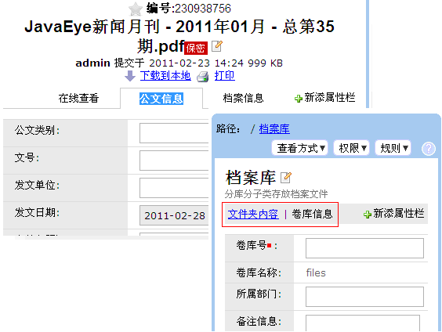
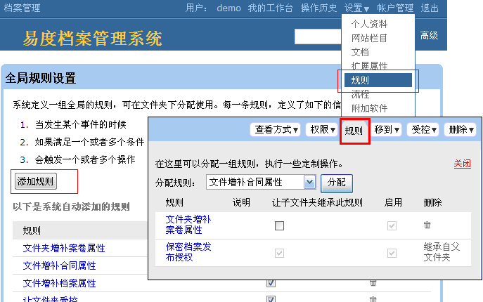
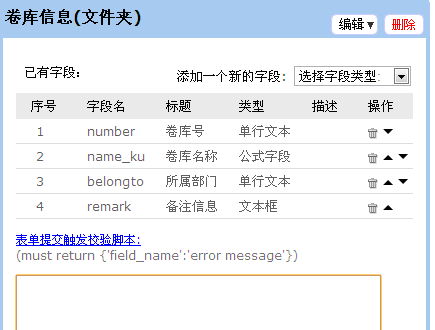
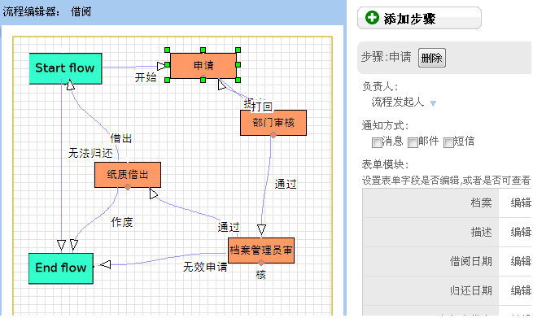
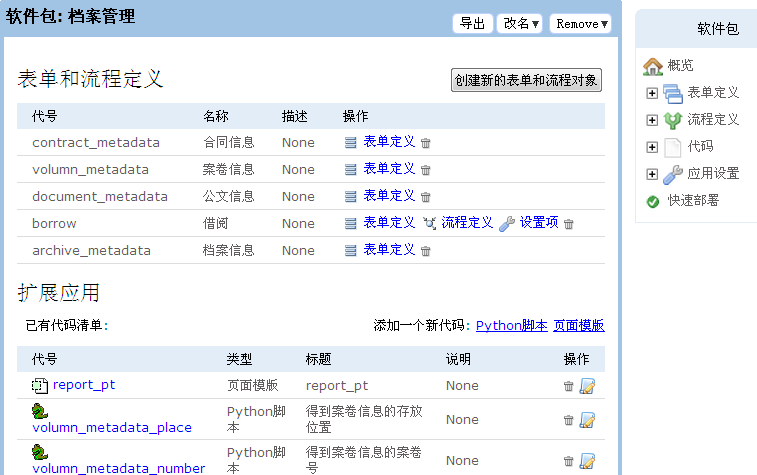

========================
易度PaaS应用引擎
========================

.. image:: img/kaifapingtai.png

易度办公平台，包括了PaaS(Platform as a Service)应用引擎功能，提供了应用快速在线开发和部署的环境。
只需一个平台，无限扩展您的各种办公应用需求。

易度PaaS开发，属于脚本开发，对开发人员要求不高，可分表定制和开发2个级别。
易度定制仅仅需要类似excel公式的制作技能；而易度开发，可以定义完整的企业应用逻辑。

-------------------------------

一：栏目定制 - 部署内置应用
================================

完整的栏目是可以完全定制的，可轻松部署一个新的内置应用。

.. image:: pic/sections.png

包括部署新栏目，调整现有栏目的顺序等

-------------------------------

二：部署扩展应用
==========================================

可从易度应用仓库中，部署新的扩展应用，满足新的办公需求。

.. image:: pic/packages.png

---------------------------------

三：扩展属性（元数据）定制
=================================

包括文档/文件夹等的扩展属性，以便记录、处理更全面的信息

-------------------------

四、规则
=====================
定义文件夹等处的网站逻辑，发生某些事件的时候，实现个性化的业务逻辑

规则让系统变得非常灵活，可实现各种特殊逻辑。
比如限制某个文件夹下上传的类型，上传文件自动发送通知邮件，初始化扩展属性等。

-----------------------------

五、表单定制
===========================
定义在线表单，可独立使用，或者在元数据定义、流程等处使用。

--------------------

六、工作流程
========================
图形化流程定制和部署，包括各种流程的串行、并行处理，实现流程自动化

-----------------------

七、软件包开发
========================
使用Python脚本，编写新的扩展应用，打包各种定制内容。

