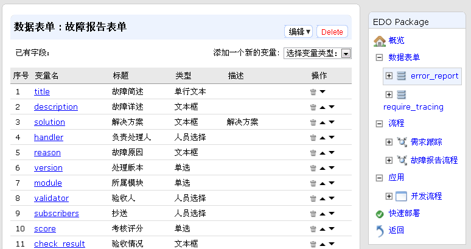
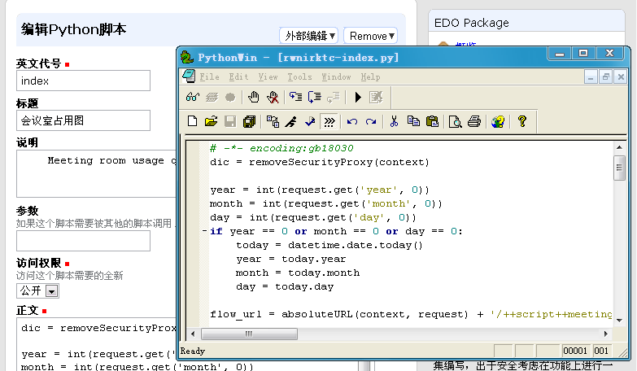

======================
易度软件包
======================

我们的windows操作系统，有非常多软件包可供选择，比如office，qq聊天，杀毒，输入法等。
通过购买软件安装光盘，或者网络下载，我们可以安装一个软件包。

同样的，再易度云办公平台上，也有类似的概念。

.. sectnum::

易度软件包
===============
软件包是易度表单定义、流程定义和代码的一个打包。通过安装和开发软件包，可扩展系统的功能。

易度软件包，是建立在易度平台这一巨人的肩膀之上。
因此可以利用易度平台的强大功能，包括文档、流程、消息等，能够快速开发，并和系统进行紧密的集成。

易度软件包，几乎可以实现任意您需要的功能。很多创新的软件包正在产生。
大部分软件包用于企业内部的管理，或者将触角伸至外网，让客户、代理商等也参与进来；
也有些易度软件包，可以集成其他复杂的软件包，将其他软件的高级功能引入易度平台。

安装软件包
=======================

在线应用仓库安装
------------------------
易度在线应用仓库中，已经汇聚了一组丰富的软件包。
我们可以在在线应用仓库中寻找软件包，直接安装到平台。

在软件包区域罗列了可安装的软件清单，可安装内置的软件，或者导入别人开发的软件，也可自行创建新软件。

.. image:: img/pkg.png
   :width: 600

（图：软件包仓库）

上传安装
-----------------
软件包开发完成，可导出为一个.edo的文件。

您可以委托第三方开发软件包，导出.edo软件包文件，上传到平台进行安装。

.. image:: img/import-pkg.png
   :width: 600

（图：上传软件包）

开发软件包
=========================
您也可以自行开发一个新的软件包，这可能需要少量的一些开发技能。

易度软件包可开发，定位是脚本级开发。也就是说，
只需要简单程序语言的基础，通过学习，能够快速掌握易度的开发。

易度软件包主要针对企业IT人员、系统集成商，以及第三方的开发人员。

表单的定制
--------------------------------------------------------------------------
这里可以定义表单的不同输入项，详细使用见定制开发栏目介绍。

流程的定制
----------------------------------------------------------------
这里可以自由定义流程的步骤和操作，图形化显示流程，操作非常灵活：

.. image:: img/flow.png
   :width: 600

逻辑代码的编写
------------------------------
当然更重要的是可以在这里编写逻辑代码，我们采用Python的一个子集进行开发：

我们支持在线编写，或者使用您喜欢的编辑器编写。

`继续学习： 使用应用管理器部署和定制 <deploy.rst>`__
