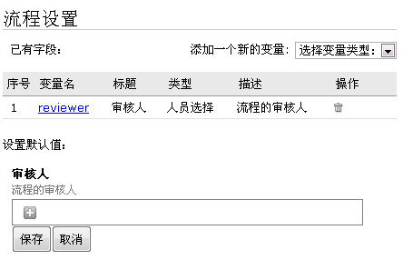

==========================================
引入定餐流程
==========================================
.. sectnum::
.. contents::

定餐流程
-----------------
能下定餐订单了，很好，但是还存在问题：

1. 定好餐了，提交人不能再改动订单了。否则定餐妹妹觉得不如白纸黑字来得实诚。
2. 餐馆经常有些事故，比如要定的菜没了之类，需要重新定餐，一个个通知这个弄起来很麻烦
3. 定好餐没有，我也不知道，定好有个通知，服务就更周到了。

   有时候订餐妹妹有事情，或者请假什么的，不能为咱服务了，咱心里有个数。

好，怎么解决这些问题呢？我们利用 流程 功能来实现吧。

设想理想的订餐流程
--------------------
我们来讨论理想的定餐流程，这实际上是个管理问题。
公司有很多管理方面的问题，都是通过流程优化来解决的。

但这个定餐流程其实很简单：

1. 公司员工定餐，下订单
2. 定餐妹妹，收集订单，成批向便当店电话订饭，这个时候有2种结果：

   - 成功定餐，向定餐人员发送消息
   - 定餐失败，比如没菜了，需要向定餐人员发送提醒，通知重新定餐。

这里我们考虑通知即时性这一点，希望能够自动发送一个短信的提醒。

理解流程的2大要素
--------------------
我们平常办公中，比如请假、报销等流程，都需要填写单据。不论是什么单据，都包括2部分：

- 表单部分：一般申请人填写，这个是流程单的主体内容
- 签字部分：一般在流程单底部，供领导和财务等签字审核确认，没有确认就流程就不能继续进行

对应的在易度的流程中，定义一个流程分为2个部分：

1. 定义流程单

   这个在 **数据表单** 中定义，前面我们已经介绍了。

2. 定义流程审核步骤

   这个在 **流程** 中定义，流程会和前面定义的数据表单进行关联。

   流程分为相互衔接的多个步骤，每个步骤会包括多个操作，不同的操作会导致不同的流程走向。

开始新流程
-------------------------
在定餐软件包中，点击新建流程，创建一个新流程。

.. image:: img/flow-dingcan.png

创建新流程的时候，需要选择和前面的订单表单关联。

默认创建的流程是 申请 -> 审核 -> 执行

做如下调整:

1. 点击流程列表中的“执行”步骤后的灰色垃圾箱图标，删除执行步骤
2. 点击审核步骤，将审核改名为定餐

.. image:: img/flow-steps.jpeg

其中定餐步骤的负责人是“ISettings(container)['reviewer']”，其中ISettings(container)在这里表示

取得流程设置的字段的值，reviewer是ISettings(container)所取得的目标。

那么ISettings(container)['reviewer']就表示读取流程设置reviewer字段的值。

审核人设置项和前面数据表单定义类似，界面如下：

如果您想更加深入了解流程，不妨去流程 设置详解_ 看看

.. _设置详解: ./settings.rst

重新部署定餐流程
--------------------------
重复上一章的应用部署操作，在定制模式中，部署一个基本应用，选择数据管理器。

选择定餐表单，这一次我们使用刚刚新建的定餐流程：

.. image:: img/deploy-flow.png

部署完毕，我们再次进入支持流程的数据管理器。我们看到多另一个“设置”按钮，
这个设置按钮展开的表单，就是流程设置的表单。现在就是默认的“审核人设置”，点击“+”号，设置行政定餐人员为审核人。

.. image:: img/spreadsheet-settings.png

**说明** ：在数据管理器里面选择流程才是真正把流程和表单联系起来了。

在A流程里选择关联B表单，那么创建数据管理器选择B表单，然后选择流程这一步才可以选择A流程

一个表单可以被多个流程关联，但是一个表单只可以选择其中的一个流程。

总结: 流程操作步骤
-------------------------------
好了，终于创建了一个有流程的数据管理器了。

1. 定义表单
2. 定义流程步骤和操作，如果有必要定义流程设置
3. 通过数据管理器或者流程中心，部署使用流程

作业
------------------
1. 添加更多的流程单设置
2. 添加更多的流程步骤

