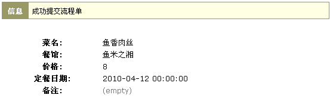

==========================================
3分钟完成定餐表单
==========================================

行政人员每个逐个人定餐，实在是超级耗时！那我们先花三分钟解决这个问题：做一个在线的定餐表单！ 

在此之前我们先来达成一个协议：

  本着够用的原则，在能够满足需要的前提下。在下面的学习中，一些地方我们会忽略过去。

  请不要担心，我们会在后续章节讲到。我们相信一个例子比洋洋洒洒的大篇文章对于初学者更有吸引力！
 
.. contents::
.. sectnum::

理解excel
======================

我们看看一个菜单的电子表格:

.. image:: img/dm-excel.jpg

这个电子表格中，有2个概念需要理解：

1. 字段

   第一行定义了每一列的含义。第一行中的每一项叫做一个字段。

   这个表格包括了菜名、餐馆、价格、定餐日期、备注这几个字段

2. 记录

   从第二行开始，每一行记录了一条数据，这叫做一个记录。

定义表单的步骤
======================
在我们平台上的表单需要经过两个步骤才可以使用：

1.表单的定义

2.表单的部署

表单定义的核心，就是定义数据的字段

类似于模板的概念，可以按照自己的意愿随意定义。

别人在使用您的表单时，就是按照定义的模板使用拉。

但是，定义也仅仅是定义，没有任何实际作用，所以  **表单一定要通过部署才可以使用。**

下面我们指导下如何在易度软件包中定义上述excel的字段

最简单的定餐软件包
============================
1. 新建一个定餐软件包

   别害怕，即便您不是职业软件开发人员，您也可以定制开发软件包的，先创建一个定餐软件包吧：

   .. image:: img/newpkg.png
      :width: 600

   （图：添加软件包）

   说明一下， **软件包是提供表单定义的地方** 
   
   每个软件包，必须有一个 **唯一的内部英文代号** ，这个代号其实类似您的身份证号，
   
   用来标识这个软件包,  **一旦创建一般不能再调整** 。我们就用“定餐”的拼音来标识这个软件包: dingcan。

2. 创建定餐表单

   已经有了一个软件，接下来创建一个定餐的表单。点击创建表单按钮:

   .. image:: img/addform1.png

   标题的添加方法如下图：

   .. image:: img/addform2.png

   （图：添加一个表单）

   表单的英文代号，含义类似上面软件包的英文代号，这里用“订餐”的拼音dingcan。

创建完成，我们看到这个表单默认自动建立了一组输入项，包括标题、描述等。

.. image:: img/defaultform.png

我是个急性子，现在开发完成了吗？还有多少步骤？好消息是，现在已经完成了80%了！

好，那先打住开发，我们来看看这个软件包如何部署运行吧。。。

(第一次开发，需要加强下信心，呵呵.其实可以完成自定义表单，然后再部署的。)

部署：准备开用了！
==============================
1. 点击左上标题旁的定制链接，进入软件定制模式.

   **定制模式是提供表单部署的地方**

   .. image:: img/customize.png
 
   （图：进入定制模式）

2. 点击右侧的按钮：添加一个基本应用

   这时候会罗列系统全部的应用，包括内置的应用和定制的应用，我们添加一个“数据管理器”应用

   添加了数据管理器，就能为表单添加、删除、修改记录咯。

   .. image:: img/addapp.jpg

   （图：添加数据管理器）

3. 选择表单“定餐”软件包的“订单”表单，确定。不使用流程，确定。

   .. image:: img/addspreadsheet.png

好，到现在，软件已经部署好了。我们可以使用了，点击下右侧的添加按钮，我们可以看到如下的表单：

.. image:: img/newsheet1.png
   :width: 600

（图：默认的表单）

啊，这个表单并非我们希望的啊，我们可能需要填写：餐馆、菜名、价格、订餐日期、备注这几个栏目。
怎么办？我们回去软件包，再开发调整下吧。

开发：自定义表单
========================
依次点击 软件包->定餐->订单，我们回到 订单 表单的定义界面：

1. 点击 标题 ，我们看到这是一个单行文本的表单输入项，我们把这个更改为 “菜名”

   .. image:: img/changetitle.png
      :width: 600

2. 同样，点击 描述 ，更改名字为 备注
3. 点击 开始日期 ，更改名字为 定餐日期，同时不要显示时间(只到日期就OK了)
4. 点击小垃圾桶，删除 结束日期，这个不需要
5. 添加一个整数类型的“价格”输入项

   .. image:: img/addfield.png

   （图：添加整数类型的输入项）

   名字为price，初始值设置为8，表示一般便当是8元一份:

   .. image:: img/pricefield.png

   (图，价格字段)

6. 添加一个单选类型的“餐馆”输入项，名字为canguan （俺英文很差，拼音还行）

   .. image:: img/radio-canguan.jpg

   我们希望公司员工定餐的时候，能从现有餐馆里面选择，省得输入了，所以我们需要额外设置下可选项::

    ['百玉蓝', '鱼米之湘', '洞庭土菜馆','兰州面馆']

好了！让我们再看看前面部署好的那个定餐电子表格什么情况了。进入订单，点击添加，我们看到一个新的定餐表单：

.. image:: img/wrongform.png

（图：顺序混乱的订餐表单）

关于变量：是字段显示的方式。像整数类型是规定了只能显示数字、单选类型是允许用户从显示的多个项中选择其中一个。

如果您有兴趣，可以 查看变量的所有说明_ 。

.. _查看变量的所有说明: ./fields.rst

调整表单输入项顺序
=============================
嗯，差不多了 ，不过，输入栏目的顺序不大理想，乱了。那再回到软件包的 订单 表单那里，调整下顺序吧，就在这里：

.. image:: img/orderfields.png

（图：调整表单顺序）

点击上下箭头，就可以调整顺序了。相信您多点几下，已经调整好顺序了。现在再去看看那个订单表单，顺序正常没。
哈哈，我的好了：

.. image:: img/rightform.png

（图：顺序调整后的定餐表单）

那我就填好表单，先定第一个餐了！我吃个久违的 鱼香肉丝 吧！没问题，加进去了：

（图：添加后的界面）

好了，点击回到定餐单数据管理器，看看那里什么情况：

.. image:: img/list.png

（图：订单列表）

这里是订单的列表，看到了我刚刚的订单：鱼香肉丝。但是在这里，看不到餐馆、价格、定餐日期信息。需要点击进入每个定餐页面才能看到。

我在为定餐的行政妹妹考虑了，如果定餐人一多，她的工作量可大了，要是在这个列表里面直接看到这些信息就好了！

别担心，易度为你想好了。现在有两个方法：

1.在表单定义的软件包中，可以预先定义显示那些信息。

.. image:: img/displayedcolumns.png
   :width: 600

（图：调整表单列表显示列）

2.部署完成后，在数据管理器中可以修改表单定义的选择。

.. image:: img/displayedcolumns-2.jpg

嗯，再回去部署好的公司定餐系统，我们看到果然如我们所想：

.. image::  img/newlist.png

（图：调整后的定餐列表）

定餐的行政妹妹会开心了吧... 好不容易，迫不及待，快让其他人来用吧！大家的效果如何？

总结：
============================
#) 易度的软件需要经过 定义 和 部署 2个环节后，才能使用。单单定义是不会把效果显示出来的。
#) 易度平台里不管是软件包还是表单等，都需要一个唯一标示的英文代号
#) 表单由不同的输入项组成，可以排序

企业有很多数据需要收集、查询统计，比如公司的固定资产情况、通讯录、员工调查等。

通过易度表单定制功能，不需要编写程序，便可实现上述数据的录入、修改和删除管理功能。定制一个表单，相当于定制一个包含数据管理界面(增删改)的数据库表。

作业：
==============================
1. 刚刚部署好的系统，是给广州分公司的，需要给北京分公司再部署一个定餐系统
2. 设置一下权限，让广州分公司的人不能在北京分公司下订单；反之依然。

   （提示，研究下各个定餐处的 权限 按钮）

3. 学习参考文档，了解下不同的表单输入项
