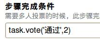

==============================
流程设置详解
==============================

流程是我们系统的一个重要特征，所以她也相对较为复杂一点。可能初学者会对于这一切觉得置身于夜晚的茫茫大海中。

但请不要担心，我们愿做为一盏导航灯，引领着各位。

.. contents::
.. sectnum::

理解步骤
================

.. image:: img/flow-steps.jpeg
   :width: 500px
   :height: 450px

我们看看，每一个步骤主要有两部分组成。
    
#) 是当前的执行的步骤,有且只有一个

    .. image:: img/purpose.jpeg

#) 执行完步骤之后的若干个操作.有一个或者多个

    .. image:: img/results.jpeg

步骤的步骤
=================
负责人
-----------------
    在我们系统中，每个人员或者群组都有一个特定的ID来唯一识别。

而负责人这一项，就是专门接收这一类ID的。那么我怎么知道其他人的ID是多少呢？

呵呵，不知道大家还记不记得，我们表单定义详解里提到过的 人员选择。

ISettings(container)['dingcanren'] 这里就取得了流程设置里面名为dingcanren 这个人员选择字段的值。其实就是那一类ID

    我们来看看上图中的context is None and [request.principal.id] or context["creators"] 

我们知道每个表单记录都有一个文件编号，这个文件编号是自动生成的，在我们系统叫做元数据（dublin core）,

每一个文件从一建立就拥有这些元数据，这种元数据当然不止文件编号一个.还有创建人（creators）、

创建时间（created）等等。当一个流程单建立的时候，每一个步骤都需要一个负责人，但是在没有成功创建表单记录的时候，

context['creators'] 是不起作用的。所以我们做了一点特殊处理，当context　是空，表单没有建立的时候，

我们赋予负责人为[request.principal.id](当前登录系统的用户的ＩＤ)，如果表单记录建立了，就赋予 context['creators'] 

通知方式
-----------------
当某个任务进行到某个步骤的时候，可以选择３种方式通知当前步骤的负责人。

表单可编辑项
-----------------
可以控制您希望用户填写的字段，不希望填写的字段

条件
-----------------
只要条件中的表达式返回为真，就可以完成步骤，相反，则无法完成步骤。

示例:
 
    可以用表达式设置特定用户才允许新建表单记录。

    只需要在流程提交步骤的条件中填入以下脚本：

    .. image:: img/flow-conditions.jpeg

触发脚本
-----------------
当执行这个步骤时，会运行这里的触发脚本，当然，这个脚本的规则是我们可爱的 python和我们的 api 

示例:

    当用户新建一个表单记录的时候，发送通知给一个特定的用户组。你也可以选择做其他的事情。

    只需要在流程提交步骤的触发脚本中填入以下代码：

    .. image:: img/flow-script.jpeg

操作
========================
执行条件
-----------------------
和参考步骤的条件类似,但是她可以直接体现在新建表单记录的时候.

当执行条件为假时，提交按钮就不会显示出来

.. image:: img/flow-commit.jpeg

步骤完成条件
-----------------------
当一个任务的负责人不止是一位的时候，可能就需要步骤完成条件了。因为系统默认只需要其中一个人执行完成，那就通过了。

但我想其中全部人或者部分人执行完了，才可以通过。可以这样，

需要负责人执行名为“通过”的操作，并且其中2个执行完成。

.. image:: img/complete.jpeg

后续步骤
-----------------------
当这个操作完成之后，就会跳到下一个或者多个步骤，如果没有选择下一个步骤，就默认会判定这个任务已经完成。

我们的系统能够可以支持处理并行、串行的行为，正是这种强大的特征，使我们的流程能适应灵活多变的企业管理

大家看看我们文控系统的技术文档审批流程图,应该就会大致明白了。

.. image:: img/flow_graphic.gif
   :height: 500px
   :width: 500px

后续步骤表达式
-----------------------
返回一组后续的动态步骤，如果设置此项。则后续步骤将失效(后续步骤仅仅用于生成流程图)

.. image:: img/step-express.jpeg

这是文控系统里面提交步骤申请操作的后续步骤表达式

当用户有填入reviewer1 字段的值，则执行一审步骤，否则执行文控确认步骤

触发脚本 
-----------------------
参考步骤的触发脚本

